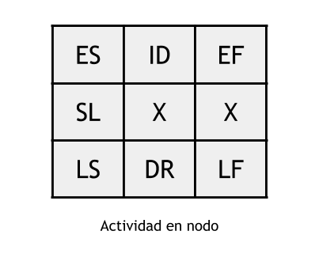
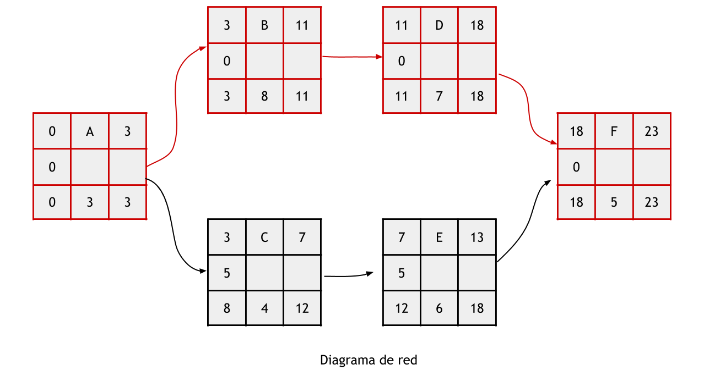

# Unidad 1 - Clase 3

## Gestión del tiempo del proyecto

_Veáse PMBOK 6_

Todos los procesos orientados a gestionar los plazos del proyecto pertenecen a esta área. Los procesos que describimos a continuación tienen como objetivo definir el cronograma del proyecto. Esto depende en mayor medida del alcance previamente definido y una de las entradas de mayor importancia para la planificacion del cronograma es la EDT del proyecto. Ademas el cronograma que se decida en la planificacion nos servira como linea base para el control de los tiempos del proyecto.

Los procesos del PMBOK que nos interesan para la gestión del tiempo del proyecto son los siguientes:
* **6.2** Definir las actividades.
* **6.3** Secuenciar las actividades.
* **6.4** Estimar los recursos de las actividades.
* **6.5** Estimar la duración de las actividades.
* **6.6** Desarrollar el cronograma.

### Definir las actividades

_Veáse PMBOK 6.2 y 6.3_

La primer tarea en la planificación de las actividades del proyecto es definirlas. El resultado final de este proceso es una lista detallada de todas las actividades y sus duraciones estimadas. Para poder realizar esta lista necesitamos una buena EDT realizada previamente. Para el estándar del PMI los nodos _hoja_ (los nodos que no tienen hijos) en el gráfico de la EDT son denominados **paquetes de trabajo**. Cada paquete de trabajo puede tener un número (relativamente pequeño) de actividades asociadas.

En la práctica, y si nuestro proyecto no es excesivamente grande, los nodos finales de la EDT se corresponden con las actividades de nuestro proyecto. Lo importante es realizar la descomposición del trabajo a realizar de manera que la estimación que hagamos de las duraciones sea lo más acertada posible. Cualquier otro atributo relevante de las actividades (recursos humanos necesarios, herramientas para la tarea, etc.) debe aparecer en esta lista. La lista de hitos (distintos entregables para el cliente, fases completadas del proyecto, etc.) también son documentados.

#### Atributos de las actividades

En la lista de actividades a menudo detallamos los atributos más importantes de las actividades. Un
tipo de atributo a destacar se conoce como **dependencia**. Las dependencias son relaciones lógicas entre actividades que indican cuándo puede iniciar o terminar una actividad en relación con las otras. Las
dependencias pueden ser:
* **Obligatorias:** son requeridas por la naturaleza del trabajo. Por ejemplo, no se puede pintar una pared antes de hacer el revoque.
* **Discrecionales:** son indicadas por las mejores prácticas pero pueden obviarse si se necesita apurar
el cronograma.
* **Internas:** son dependencias que tienen su origen dentro del equipo del proyecto o la organización que lo lleva a cabo.
* **Externas:** son dependencias que surgen por ejemplo cuando se subcontrata una parte del proyecto. Debo esperar a un tercero por fuera de la organización para tener un componente del proyecto.

Además las dependencias se clasifican por la relación que tiene con sus antecesoras o sucesoras:
* **Final a inicio:** una actividad sucesora no comienza hasta que haya terminado su antecesor.
* **Final a final:** no se puede finalizar una actividad hasta que su antecesora finalice.
* **Inicio a inicio:** no se puede iniciar una activdad hasta que su antecesora inicie.
* **Inicio a final:** no se puede finalizar una actividad hasta que comience su predecesora. Rara vez se usa esta dependencia.

Otros atributos importantes de las actividades son:
* Adelantos y retrasos
* Fechas obligatorias
* Duración estimada
* Costo estimado
* Recursos asignados (personas, máquinas, etc.)

### Dependencias de las actividades

_Veáse PMBOK 6.3_

Las actividades del proyecto deben secuenciarse de acuerdo a sus relaciones. Teniendo en cuenta la lista de actividades ya definida, deben analizarse las relaciones que existen entre las mismas. Para secuenciar las actividades y armar un cronograma a menudo se usa el **método del camino crítico** (_CPM Critical Path Method_). El CPM es un método que ayuda a calcular parámetros básicos del cronograma del proyecto. La manera gráfica de realizarlo es a través de un **diagrama de red**.

#### Diagrama de red

Un diagrama de red es un _grafo dirigido_ que representa las dependencias y duraciones de todas las actividades de un proyecto. Además permite realizar rápidamente el cálculo de la ruta crítica del proyecto y de la holgura de cada actividad. Cada actividad es un nodo o vértice del grafo dónde se representan los siguientes atributos de cada actividad:

* ID o nombre de la actividad
* Duración (DR)
* Inicio temprano (ES)
* Inicio tardío (LS)
* Finalización temprana (EF)
* Finalización tardía (LF)
* Holgura (SL)

    

Para el cálculo de la ruta crítica y el tiempo total del proyecto se realiza un paso de izquierda a derecha del diagrama, calculando las fechas de inicio y finalización temprana de cada nodo teniendo en cuenta las dependencias de cada actividad representadas por las flechas. Para el cálculo de la holgura se realiza un paso hacia atrás (de derecha a izquierda) calculando los inicios y finalización tardías de cada actividad. La holgura de una actividad representa la cantidad en unidades de tiempo (días, horas, etc.) que una actividad puede retrasarse sin afectar el tiempo total del proyecto determinado por la ruta crítica. Por definición, las actividades en la ruta crítica tienen cero holgura.

    

#### Diagrama de Gantt

Un diagrama de Gantt es una herramienta gráfica que permite representar una línea de tiempo con las actividades de un proyecto. Su uso es bastante extendido en proyectos de todo tipo de industria. Se trata básicamente de una tabla de doble entrada, con las filas representando las distintas actividades e hitos de un proyecto, y las columnas las fechas de un calendario. Por este motivo es un gráfico que permite visualizar el cronograma del proyecto de un solo vistazo y representar el avance del mismo. La notación más extendida que mostramos en la figura representa en cada fila una barra que se extiende de inicio a fin planificado de cada actividad. Muchas veces se usa algún color para representar el avance de cada tarea, su porcentaje completado. Las dependencias entre actividades se marcan con líneas entre cada barra, remarcando en rojo las actividades y dependencias que están en la ruta crítica del proyecto. Al lado (o dentro) de cada barra se puede asignar equipos o personal responsable de cada actividad. Los hitos (que no poseen duración) utilizando rombos, a veces marcando la fecha esperada para llegar a cada uno de los hitos o entregables del proyecto. Por último se puede extender una línea gruesa para cada barra que no esté en la ruta crítica marcando la holgura de la misma.

### Desarrollo del cronograma y control

El cronograma del proyecto representa una línea base para el desarrollo y control del tiempo del proyecto. Comparamos el rendimiento y avance del proyecto contra el cronograma, y gestionamos los recursos de acuerdo a las desviaciones de lo planificado. Generalmente la herramienta esencial para esta tarea es un diagrama de Gantt completo que represente el estado actual real del proyecto. Comparando la ejecución real del proyecto con los plazos acordados durante la planificación podemos gestionar los recursos (humanos, herramientas, insumos) y ajustar las desviaciones que son casi ineludibles, o pactar nuevos plazos con los interesados del proyecto.

## Cuestionario

1. ¿Cuál es la diferencia entre un paquete de trabajo y una actividad?
2. Dar tres ejemplos de actividades y sus atributos.
3. ¿Qué tipos de dependencia existen entre las actividades?
4. ¿Qué es la secuenciación de actividades y el método del camino crítico?
5. Realizar un diagrama de red utilizando la siguiente lista de actividades.

ACT|DUR|PRE
---|---|---
A|2|-
B|3|-
C|1|A
D|4|A, B
E|2|C, D
F|2|E
G|3|E
H|1|F
I|4|G
J|2|H, I
K|3|I

6. ¿Para qué sirve calcular la holgura de una actividad?
7. ¿Qué es un calendario de recursos?
8. Realizar un diagrama de red utilizando la siguiente lista de actividades.

ACT|DUR|PRE
---|---|---
A|1|-
B|1|A
C|2|A
D|4|B
E|2|C
F|3|C
G|2|D
H|1|E, F
I|3|G, H
J|2|I
K|1|I

9. Realizar los diagramas de Gantt correspondientes a los diagramas de red anteriores.
10. Asignar recursos a los diagramas de Gantt del ejercicio anterior. ¿Cuántas
personas necesita el equipo del proyecto si una persona puede realizar una sola actividad
en simultáneo?
